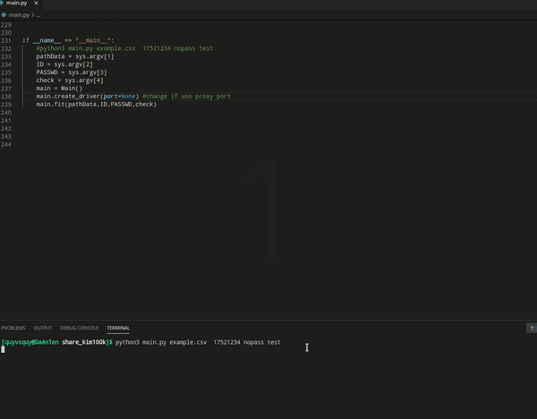

# Auto select courses uit
A tool to help you automatically select answers on course.uit.edu.vn based on the database.\

# Environments
- linux (Windows maybe)
- python 3
- firefox
- firefox webdriver
- all library in **`requirements.txt`**. (`python3 -m pip install requirements.txt`)
# Features
- Hide ip with proxy port or change different ip.
- Find answer base on database and click with multi type (radio, muilti choose).
- Clickable on images, sounds.
- Automatically switch pages until the end.
- Can try again on the saved html file.
# Usage
1. Create file `database.csv` with form `answers,questions`. `answers,questions1___questions2___questions3` if multi choose (3 `_`). For more read file `example.csv`

2. Change the link in `fit` function (main.py). And run commands below
    ```python
    python3 main.py path_data id password type
    ```
    Example:
    > python3 main.py example.csv 17521234 nopass t

    | Attribute | Description|
    | --- | --- | 
    | path_data | Where to store the database.csv (including answers and questions)|
    | id, password | id and password on courses |
    | type | run on saved html file if `test`, else run on link in `fit` function|
